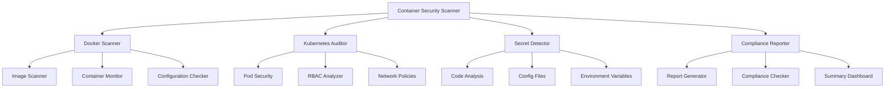
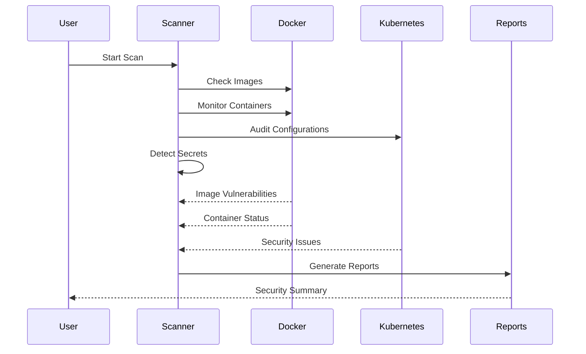
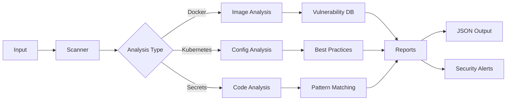
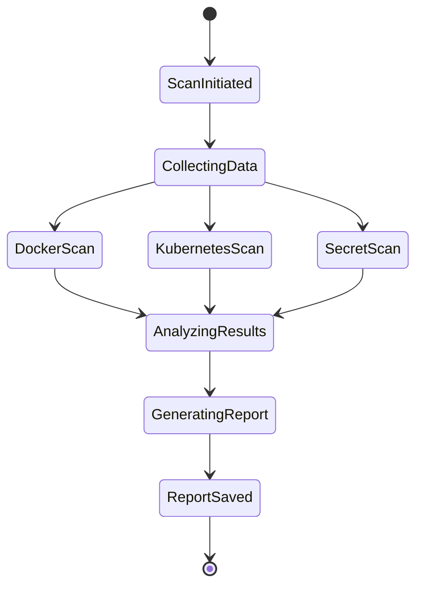
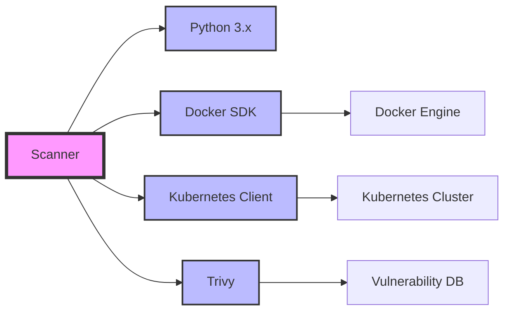

# Container Security Scanner Architecture

## System Components

```mermaid
graph TB
    A[Container Security Scanner] --> B[Docker Scanner]
    A --> C[Kubernetes Auditor]
    A --> D[Secret Detector]
    A --> E[Compliance Reporter]
    
    B --> B1[Image Scanner]
    B --> B2[Container Monitor]
    B --> B3[Configuration Checker]
    
    C --> C1[Pod Security]
    C --> C2[RBAC Analyzer]
    C --> C3[Network Policies]
    
    D --> D1[Code Analysis]
    D --> D2[Config Files]
    D --> D3[Environment Variables]
    
    E --> E1[Report Generator]
    E --> E2[Compliance Checker]
    E --> E3[Summary Dashboard]
```

## Scanning Workflow

```mermaid
sequenceDiagram
    participant U as User
    participant S as Scanner
    participant D as Docker
    participant K as Kubernetes
    participant R as Reports
    
    U->>S: Start Scan
    S->>D: Check Images
    S->>D: Monitor Containers
    S->>K: Audit Configurations
    S->>S: Detect Secrets
    
    D-->>S: Image Vulnerabilities
    D-->>S: Container Status
    K-->>S: Security Issues
    
    S->>R: Generate Reports
    R-->>U: Security Summary
```

## Data Flow

```mermaid
flowchart LR
    A[Input] --> B[Scanner]
    B --> C{Analysis Type}
    C -->|Docker| D[Image Analysis]
    C -->|Kubernetes| E[Config Analysis]
    C -->|Secrets| F[Code Analysis]
    
    D --> G[Vulnerability DB]
    E --> H[Best Practices]
    F --> I[Pattern Matching]
    
    G --> J[Reports]
    H --> J
    I --> J
    
    J --> K[JSON Output]
    J --> L[Security Alerts]
```

## Report Generation Process

```mermaid
stateDiagram-v2
    [*] --> ScanInitiated
    ScanInitiated --> CollectingData
    CollectingData --> DockerScan
    CollectingData --> KubernetesScan
    CollectingData --> SecretScan
    
    DockerScan --> AnalyzingResults
    KubernetesScan --> AnalyzingResults
    SecretScan --> AnalyzingResults
    
    AnalyzingResults --> GeneratingReport
    GeneratingReport --> ReportSaved
    ReportSaved --> [*]
```

## Component Dependencies

```mermaid
graph LR
    A[Scanner] --> B[Python 3.x]
    A --> C[Docker SDK]
    A --> D[Kubernetes Client]
    A --> E[Trivy]
    
    C --> F[Docker Engine]
    D --> G[Kubernetes Cluster]
    E --> H[Vulnerability DB]
    
    style A fill:#f9f,stroke:#333,stroke-width:4px
    style B fill:#bbf,stroke:#333,stroke-width:2px
    style C fill:#bbf,stroke:#333,stroke-width:2px
    style D fill:#bbf,stroke:#333,stroke-width:2px
    style E fill:#bbf,stroke:#333,stroke-width:2px
``` 